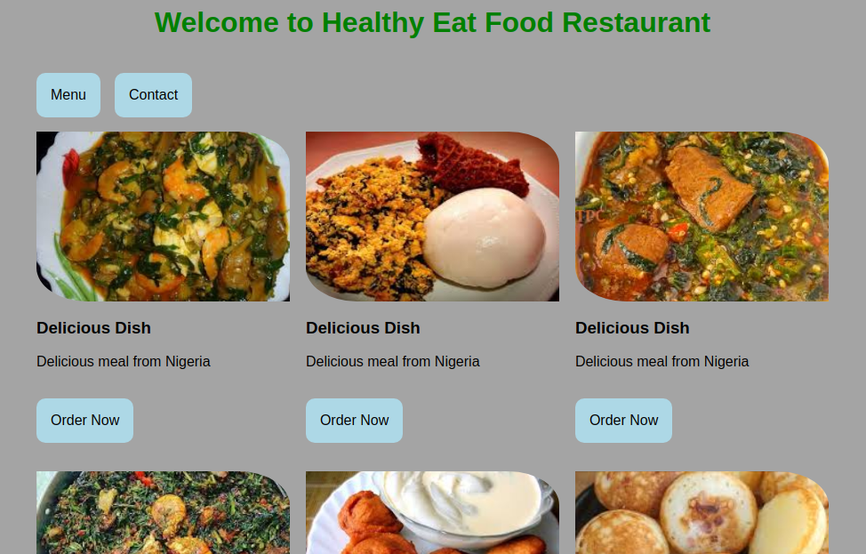

# Project:  Restaurant Page

> This is an implementation of Microverse Restaurant Page project.
> The project was built using webpack to bundle application dependencies.


##  Environments/System dependencies

* HTML

* SCSS

* JavaScript

* Webpack


##  Setup

* Clone the project from ```git@github.com:ezeilo-su/restaurant-page.git```.

* Run the command ```npm install``` from root directory to install the app dependencies.

* Run the command ```npx webpack``` to bundle up the files.

* Open the file ```dist/index.html``` file with a web browser to run the app.

## Check out live demo [here](https://elastic-goodall-394d0c.netlify.app/)

###  Project screenshot:





## Author

👤 **Sunday Uche Ezeilo**

- Github: [@sundayezeilo](https://github.com/ezeilo-su)
- Twitter: [@SundayEzeilo](https://twitter.com/SundayEzeilo)
- Linkedin: [Sunday Ezeilo](https://www.linkedin.com/in/sunday-ezeilo-a6a67664/)

## 🤝 Contributing

Contributions, issues and feature requests will be appreciated.

Feel free to check the [issues page](https://github.com/ezeilo-su/restaurant-page/issues)

## Show your support

Show support by giving a ⭐️ if you like this project!
